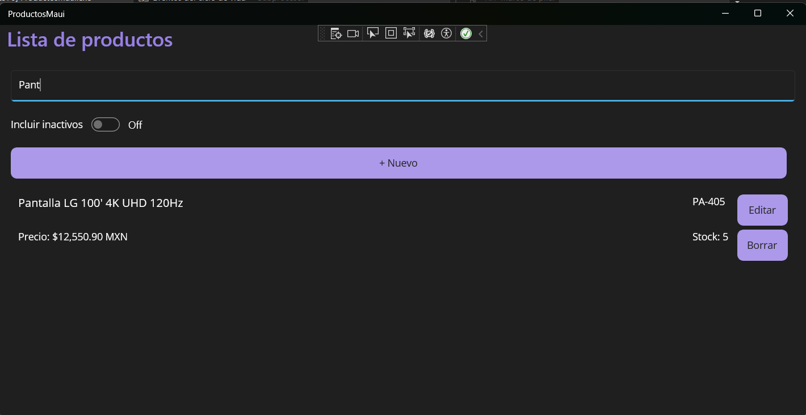
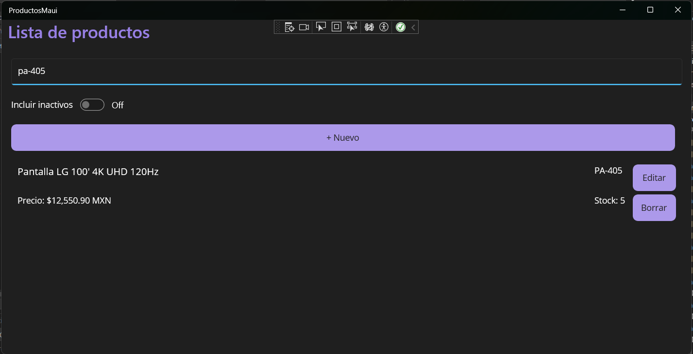
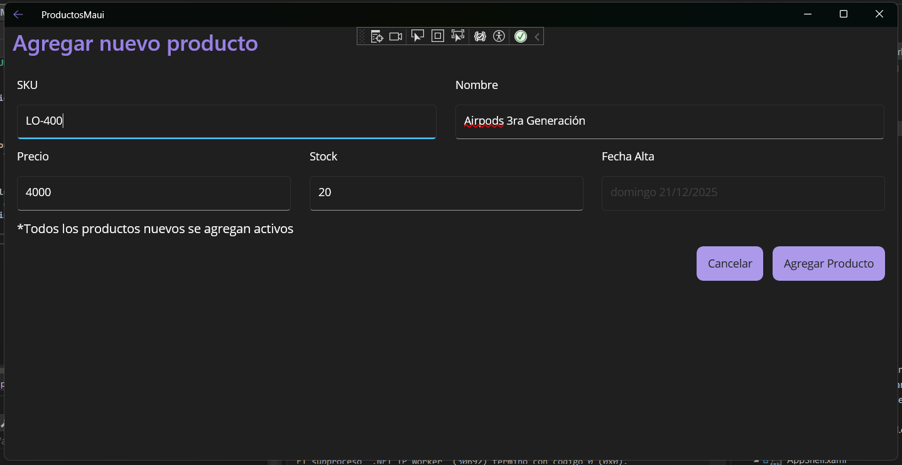
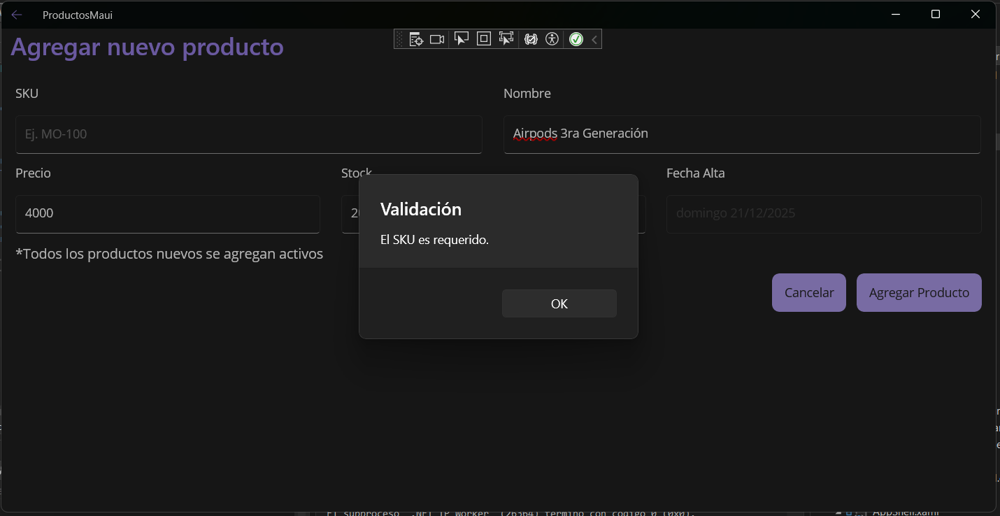
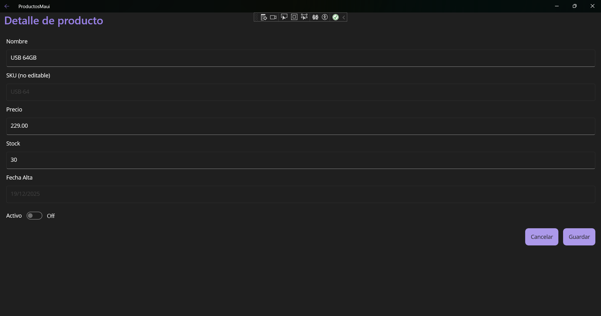

# Products CRUD (MAUI + SQLite)

## Requisitos
- Visual Studio 2022 **.NET MAUI**
- .NET SDK 8

- ## Setup
No requiere configuración manual.
- La app crea la base de datos automáticamente usando SQLite.

## Ejecución
1. Abre la solución en Visual Studio 2022.
2. Selecciona el target **Windows Machine** y presiona **Run (F5)**.
3. Listo: al iniciar, la app crea la base de datos y carga un **seed** con productos demo (si es la primera vez).

## Capturas (flujo principal)

### Búsqueda por Nombre

### Búsqueda por SKU

### Listado (solo activos)
.png)

### Listado (activos e inactivos)
.png)

### Agregar producto

### Validación al agregar

### Editar producto

